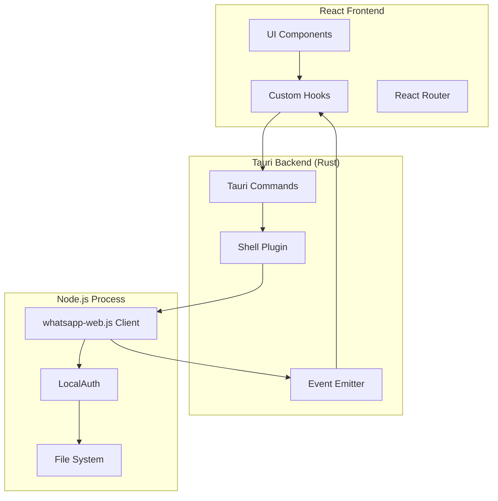

# Design Document - WhatsApp Automation Desktop Application

## Overview

This document describes the technical design for a WhatsApp automation desktop application built with Tauri 2.x, React 19, and whatsapp-web.js. The application enables users to connect their WhatsApp account, manage groups, extract member data, add users in bulk, and create custom automations.

The architecture follows a clear separation between the Rust backend (Tauri), Node.js WhatsApp client process, and React frontend, with bidirectional communication via Tauri's command and event systems.

## Architecture

### High-Level Architecture



### Communication Flow

1. **Frontend → Backend**: React uses `invoke()` to call Tauri commands
2. **Backend → Node.js**: Tauri uses `tauri-plugin-shell` to spawn and communicate with Node.js process via stdio
3. **Node.js → Backend**: Node.js sends JSON messages via stdout
4. **Backend → Frontend**: Tauri emits events that React listens to

## Components and Interfaces

### 1. Tauri Backend (Rust)

#### File Structure

```
src-tauri/
├── src/
│   ├── main.rs                 # Entry point, window setup
│   ├── commands.rs             # Tauri command handlers
│   ├── whatsapp/
│   │   ├── mod.rs             # WhatsApp module
│   │   ├── client.rs          # Node.js process management
│   │   └── types.rs           # Rust types for WhatsApp data
│   ├── automation/
│   │   ├── mod.rs             # Automation engine
│   │   ├── storage.rs         # JSON persistence
│   │   └── executor.rs        # Automation execution
│   └── logging/
│       ├── mod.rs             # Logging system
│       └── logger.rs          # Log management
├── whatsapp-node/
│   ├── package.json
│   ├── index.js               # Node.js WhatsApp client
│   └── session/               # Session data directory
└── Cargo.toml
```

#### Key Tauri Commands

```rust
// commands.rs

#[tauri::command]
async fn initialize_whatsapp(app_handle: tauri::AppHandle) -> Result<(), String>

#[tauri::command]
async fn get_groups() -> Result<Vec<GroupInfo>, String>

#[tauri::command]
async fn extract_group_members(group_id: String) -> Result<Vec<Participant>, String>

#[tauri::command]
async fn add_users_to_group(
    group_id: String,
    phone_numbers: Vec<String>,
    delay_seconds: u64
) -> Result<AdditionReport, String>

#[tauri::command]
async fn create_automation(automation: Automation) -> Result<String, String>

#[tauri::command]
async fn get_automations() -> Result<Vec<Automation>, String>

#[tauri::command]
async fn delete_automation(id: String) -> Result<(), String>

#[tauri::command]
async fn get_logs(filter: LogFilter) -> Result<Vec<LogEntry>, String>
```

#### Event Emissions

```rust
// Events emitted to frontend
app_handle.emit_all("whatsapp_qr", QRPayload { qr_base64: String })
app_handle.emit_all("whatsapp_ready", ReadyPayload { phone_number: String })
app_handle.emit_all("whatsapp_disconnected", DisconnectedPayload {})
app_handle.emit_all("whatsapp_message", MessagePayload { /* ... */ })
app_handle.emit_all("automation_progress", ProgressPayload { current: u32, total: u32 })
app_handle.emit_all("automation_finished", FinishedPayload { report: AdditionReport })
app_handle.emit_all("automation_error", ErrorPayload { message: String })
app_handle.emit_all("log_entry", LogEntry { /* ... */ })
```

### 2. Node.js WhatsApp Client

#### File Structure

```
whatsapp-node/
├── index.js                    # Main client
├── handlers/
│   ├── qr.js                  # QR code handler
│   ├── ready.js               # Ready handler
│   ├── message.js             # Message handler
│   └── disconnected.js        # Disconnection handler
├── operations/
│   ├── getGroups.js           # Get all groups
│   ├── extractMembers.js      # Extract group members
│   └── addToGroup.js          # Add users to group
└── session/                    # LocalAuth session storage
```

#### Main Client Implementation

```javascript
// index.js
const { Client, LocalAuth } = require('whatsapp-web.js')
const qrcode = require('qrcode')

const client = new Client({
    authStrategy: new LocalAuth({
        dataPath: './session'
    }),
    puppeteer: {
        headless: true,
        args: ['--no-sandbox']
    }
})

// Communication protocol with Tauri
function sendToTauri(event, data) {
    console.log(JSON.stringify({ event, data }))
}

client.on('qr', async (qr) => {
    const qrBase64 = await qrcode.toDataURL(qr)
    sendToTauri('whatsapp_qr', { qr_base64: qrBase64 })
})

client.on('ready', () => {
    sendToTauri('whatsapp_ready', {
        phone_number: client.info.wid.user
    })
})

client.on('disconnected', (reason) => {
    sendToTauri('whatsapp_disconnected', { reason })
})

client.on('message', async (message) => {
    sendToTauri('whatsapp_message', {
        from: message.from,
        body: message.body,
        timestamp: message.timestamp
    })
})

// Listen for commands from Tauri via stdin
process.stdin.on('data', async (data) => {
    const command = JSON.parse(data.toString())

    switch (command.type) {
        case 'get_groups':
            await handleGetGroups()
            break
        case 'extract_members':
            await handleExtractMembers(command.group_id)
            break
        case 'add_to_group':
            await handleAddToGroup(
                command.group_id,
                command.numbers,
                command.delay
            )
            break
    }
})

client.initialize()
```

### 3. React Frontend

#### File Structure

```
src/
├── app/
│   ├── App.tsx                 # Main app component
│   ├── provider.tsx            # Global providers
│   └── router.tsx              # Route configuration
├── pages/
│   ├── Connect.tsx             # WhatsApp connection page
│   ├── Dashboard.tsx           # Main dashboard
│   ├── ExtractUsers.tsx        # Extract group members
│   ├── AddToGroup.tsx          # Add users to group
│   ├── Automations.tsx         # Automation management
│   ├── Logs.tsx                # Log viewer
│   └── Settings.tsx            # Application settings
├── components/
│   ├── layout/
│   │   ├── Sidebar.tsx         # Navigation sidebar
│   │   └── Layout.tsx          # Main layout wrapper
│   ├── whatsapp/
│   │   ├── QRCodeViewer.tsx    # QR code display
│   │   ├── ConnectionStatus.tsx # Connection indicator
│   │   └── GroupSelector.tsx   # Group selection dropdown
│   ├── automation/
│   │   ├── AutomationForm.tsx  # Create/edit automation
│   │   ├── AutomationList.tsx  # List of automations
│   │   └── TriggerSelector.tsx # Trigger configuration
│   ├── ui/
│   │   ├── Button.tsx          # Shadcn button
│   │   ├── Card.tsx            # Shadcn card
│   │   ├── Table.tsx           # Shadcn table
│   │   └── ...                 # Other Shadcn components
│   └── shared/
│       ├── ProgressBar.tsx     # Progress indicator
│       └── FileUpload.tsx      # File upload component
├── lib/
│   ├── whatsapp.ts             # WhatsApp Tauri integration
│   ├── automation.ts           # Automation helpers
│   └── utils.ts                # Utility functions
├── hooks/
│   ├── useWhatsApp.ts          # WhatsApp connection hook
│   ├── useGroups.ts            # Groups management hook
│   ├── useAutomations.ts       # Automations hook
│   └── useLogs.ts              # Logs hook
├── types/
│   ├── whatsapp.ts             # WhatsApp types
│   ├── automation.ts           # Automation types
│   └── index.ts                # Exported types
└── stores/
    ├── whatsappStore.ts        # WhatsApp state (Zustand)
    └── automationStore.ts      # Automation state
```

#### Key React Hooks

```typescript
// hooks/useWhatsApp.ts
export function useWhatsApp() {
    const [status, setStatus] = useState<
        'disconnected' | 'connecting' | 'connected'
    >('disconnected')
    const [qrCode, setQrCode] = useState<string | null>(null)

    useEffect(() => {
        const unlistenQR = listen('whatsapp_qr', (event) => {
            setQrCode(event.payload.qr_base64)
            setStatus('connecting')
        })

        const unlistenReady = listen('whatsapp_ready', () => {
            setStatus('connected')
            setQrCode(null)
        })

        const unlistenDisconnected = listen('whatsapp_disconnected', () => {
            setStatus('disconnected')
        })

        return () => {
            unlistenQR.then((fn) => fn())
            unlistenReady.then((fn) => fn())
            unlistenDisconnected.then((fn) => fn())
        }
    }, [])

    const connect = async () => {
        await invoke('initialize_whatsapp')
    }

    return { status, qrCode, connect }
}
```

```typescript
// hooks/useGroups.ts
export function useGroups() {
    const [groups, setGroups] = useState<GroupInfo[]>([])
    const [loading, setLoading] = useState(false)

    const fetchGroups = async () => {
        setLoading(true)
        try {
            const result = await invoke<GroupInfo[]>('get_groups')
            setGroups(result)
        } catch (error) {
            console.error('Failed to fetch groups:', error)
        } finally {
            setLoading(false)
        }
    }

    const extractMembers = async (groupId: string) => {
        return await invoke<Participant[]>('extract_group_members', { groupId })
    }

    return { groups, loading, fetchGroups, extractMembers }
}
```

## Data Models

### TypeScript Types (Frontend)

```typescript
// types/whatsapp.ts

export interface GroupInfo {
    id: string
    name: string
    participantCount: number
    isAdmin: boolean
}

export interface Participant {
    phoneNumber: string
    name: string | null
    isAdmin: boolean
}

export interface AdditionReport {
    successful: string[]
    failed: FailedAddition[]
    totalProcessed: number
}

export interface FailedAddition {
    phoneNumber: string
    reason: string
}

export interface Automation {
    id: string
    name: string
    enabled: boolean
    trigger: AutomationTrigger
    actions: AutomationAction[]
    createdAt: string
}

export type AutomationTrigger =
    | { type: 'on_message'; filter?: MessageFilter }
    | { type: 'on_group_join'; groupId?: string }
    | { type: 'on_app_start' }

export type AutomationAction =
    | { type: 'send_message'; to: string; message: string; delay?: number }
    | { type: 'extract_info'; groupId: string }
    | { type: 'add_to_group'; groupId: string; numbers: string[] }
    | { type: 'save_to_list'; listName: string; data: any }

export interface LogEntry {
    id: string
    timestamp: string
    level: 'info' | 'warning' | 'error'
    category: 'general' | 'automation' | 'whatsapp'
    message: string
}
```

### Rust Types (Backend)

```rust
// src/whatsapp/types.rs

use serde::{Deserialize, Serialize};

#[derive(Debug, Serialize, Deserialize, Clone)]
pub struct GroupInfo {
    pub id: String,
    pub name: String,
    pub participant_count: u32,
    pub is_admin: bool,
}

#[derive(Debug, Serialize, Deserialize, Clone)]
pub struct Participant {
    pub phone_number: String,
    pub name: Option<String>,
    pub is_admin: bool,
}

#[derive(Debug, Serialize, Deserialize)]
pub struct AdditionReport {
    pub successful: Vec<String>,
    pub failed: Vec<FailedAddition>,
    pub total_processed: u32,
}

#[derive(Debug, Serialize, Deserialize)]
pub struct FailedAddition {
    pub phone_number: String,
    pub reason: String,
}

#[derive(Debug, Serialize, Deserialize, Clone)]
pub struct Automation {
    pub id: String,
    pub name: String,
    pub enabled: bool,
    pub trigger: AutomationTrigger,
    pub actions: Vec<AutomationAction>,
    pub created_at: String,
}

#[derive(Debug, Serialize, Deserialize, Clone)]
#[serde(tag = "type")]
pub enum AutomationTrigger {
    OnMessage { filter: Option<MessageFilter> },
    OnGroupJoin { group_id: Option<String> },
    OnAppStart,
}

#[derive(Debug, Serialize, Deserialize, Clone)]
#[serde(tag = "type")]
pub enum AutomationAction {
    SendMessage { to: String, message: String, delay: Option<u64> },
    ExtractInfo { group_id: String },
    AddToGroup { group_id: String, numbers: Vec<String> },
    SaveToList { list_name: String, data: serde_json::Value },
}
```

## Error Handling

### Error Types

```rust
// src/error.rs

use thiserror::Error;

#[derive(Error, Debug)]
pub enum AppError {
    #[error("WhatsApp client not initialized")]
    ClientNotInitialized,

    #[error("WhatsApp client not connected")]
    ClientNotConnected,

    #[error("Group not found: {0}")]
    GroupNotFound(String),

    #[error("Failed to add user {0}: {1}")]
    AddUserFailed(String, String),

    #[error("Automation not found: {0}")]
    AutomationNotFound(String),

    #[error("Invalid automation configuration: {0}")]
    InvalidAutomation(String),

    #[error("File operation failed: {0}")]
    FileError(#[from] std::io::Error),

    #[error("JSON serialization failed: {0}")]
    SerializationError(#[from] serde_json::Error),

    #[error("Node.js process error: {0}")]
    NodeProcessError(String),
}

impl From<AppError> for String {
    fn from(error: AppError) -> Self {
        error.to_string()
    }
}
```

### Frontend Error Handling

```typescript
// lib/errorHandler.ts

export class WhatsAppError extends Error {
    constructor(
        message: string,
        public code: string,
        public details?: any
    ) {
        super(message)
        this.name = 'WhatsAppError'
    }
}

export function handleTauriError(error: unknown): WhatsAppError {
    if (typeof error === 'string') {
        return new WhatsAppError(error, 'TAURI_ERROR')
    }

    if (error instanceof Error) {
        return new WhatsAppError(error.message, 'UNKNOWN_ERROR')
    }

    return new WhatsAppError('An unknown error occurred', 'UNKNOWN_ERROR')
}

export function showErrorToast(error: WhatsAppError) {
    // Integration with toast notification system
    toast.error(error.message)
}
```

## Testing Strategy

### Unit Tests

#### Rust Backend Tests

```rust
// src/whatsapp/client.rs

#[cfg(test)]
mod tests {
    use super::*;

    #[test]
    fn test_parse_node_message() {
        let json = r#"{"event":"whatsapp_ready","data":{"phone_number":"123456"}}"#;
        let message = parse_message(json).unwrap();
        assert_eq!(message.event, "whatsapp_ready");
    }

    #[tokio::test]
    async fn test_group_extraction() {
        // Mock Node.js response
        let mock_response = vec![
            Participant {
                phone_number: "123456".to_string(),
                name: Some("Test User".to_string()),
                is_admin: false,
            }
        ];

        // Test extraction logic
        assert_eq!(mock_response.len(), 1);
    }
}
```

#### React Component Tests

```typescript
// components/whatsapp/__tests__/QRCodeViewer.test.tsx

import { render, screen } from '@testing-library/react';
import { QRCodeViewer } from '../QRCodeViewer';

describe('QRCodeViewer', () => {
    it('renders QR code when provided', () => {
        const qrCode = 'data:image/png;base64,test';
        render(<QRCodeViewer qrCode={qrCode} />);

        const img = screen.getByRole('img');
        expect(img).toHaveAttribute('src', qrCode);
    });

    it('shows loading state when no QR code', () => {
        render(<QRCodeViewer qrCode={null} />);
        expect(screen.getByText(/aguardando/i)).toBeInTheDocument();
    });
});
```

### Integration Tests

```typescript
// tests/integration/whatsapp-flow.test.ts

describe('WhatsApp Connection Flow', () => {
    it('should connect and fetch groups', async () => {
        // Mock Tauri invoke
        mockIPC((cmd, args) => {
            if (cmd === 'initialize_whatsapp') {
                // Simulate QR event
                emit('whatsapp_qr', { qr_base64: 'test' })
                return Promise.resolve()
            }
            if (cmd === 'get_groups') {
                return Promise.resolve([
                    {
                        id: '1',
                        name: 'Test Group',
                        participantCount: 5,
                        isAdmin: true
                    }
                ])
            }
        })

        const { result } = renderHook(() => useWhatsApp())

        await act(async () => {
            await result.current.connect()
        })

        expect(result.current.status).toBe('connecting')
        expect(result.current.qrCode).toBe('test')
    })
})
```

### End-to-End Tests

```typescript
// e2e/automation.spec.ts

import { test, expect } from '@playwright/test'

test('create and execute automation', async ({ page }) => {
    await page.goto('http://localhost:1420')

    // Wait for connection
    await page.waitForSelector('text=Conectado')

    // Navigate to automations
    await page.click('text=Automação')

    // Create new automation
    await page.click('text=Nova Automação')
    await page.fill('[name="name"]', 'Test Automation')
    await page.selectOption('[name="trigger"]', 'on_message')
    await page.click('text=Salvar')

    // Verify automation appears in list
    await expect(page.locator('text=Test Automation')).toBeVisible()
})
```

## Performance Considerations

### 1. Node.js Process Management

- Use single long-running Node.js process instead of spawning per operation
- Implement process health checks and automatic restart on crash
- Use stdio for communication to minimize overhead

### 2. Event Throttling

- Throttle high-frequency events (messages) to prevent UI overload
- Batch log entries before sending to frontend
- Use debouncing for user input in automation forms

### 3. Data Pagination

- Implement virtual scrolling for large log lists
- Paginate group member extraction for groups with 1000+ members
- Lazy load automation history

### 4. Session Management

- Cache group list in memory to avoid repeated fetches
- Persist UI state (selected group, filters) to localStorage
- Implement connection pooling for database operations (if added later)

## Security Considerations

### 1. Session Data Protection

- Store WhatsApp session in encrypted format
- Use Tauri's secure storage APIs for sensitive data
- Implement file permissions to restrict session access

### 2. Input Validation

- Validate phone numbers format before processing
- Sanitize user input in automation messages
- Limit file upload sizes for user lists

### 3. Rate Limiting

- Implement delays between bulk operations to avoid WhatsApp bans
- Configurable rate limits (default: 2-10 seconds between adds)
- Warn users about WhatsApp's anti-spam policies

### 4. Code Security

- Use Content Security Policy in Tauri config
- Disable Node.js integration in frontend
- Validate all IPC messages between frontend and backend

## Deployment Configuration

### Tauri Configuration

```json
// tauri.conf.json
{
    "build": {
        "beforeDevCommand": "pnpm dev",
        "beforeBuildCommand": "pnpm build",
        "devPath": "http://localhost:1420",
        "distDir": "../dist"
    },
    "package": {
        "productName": "WhatsApp Automation",
        "version": "1.0.0"
    },
    "tauri": {
        "allowlist": {
            "all": false,
            "shell": {
                "all": false,
                "execute": true,
                "sidecar": true,
                "open": false
            },
            "fs": {
                "all": false,
                "readFile": true,
                "writeFile": true,
                "readDir": true,
                "createDir": true,
                "scope": ["$APPDATA/*", "$RESOURCE/*"]
            }
        },
        "bundle": {
            "active": true,
            "targets": ["msi", "dmg", "appimage"],
            "identifier": "com.whatsapp.automation",
            "icon": [
                "icons/32x32.png",
                "icons/128x128.png",
                "icons/icon.icns",
                "icons/icon.ico"
            ],
            "resources": ["whatsapp-node/**/*"],
            "externalBin": ["node"]
        },
        "security": {
            "csp": "default-src 'self'; img-src 'self' data: blob:; style-src 'self' 'unsafe-inline'"
        },
        "windows": [
            {
                "title": "WhatsApp Automation",
                "width": 1200,
                "height": 800,
                "resizable": true,
                "fullscreen": false
            }
        ]
    }
}
```

### Build Process

1. **Frontend Build**: Vite builds React app to `dist/`
2. **Node.js Bundle**: Copy `whatsapp-node/` to resources
3. **Rust Compilation**: Cargo builds Tauri backend
4. **Asset Bundling**: Include Node.js runtime as sidecar
5. **Platform Packaging**: Generate installers for each platform

## Development Workflow

### Local Development

```bash
# Terminal 1: Start Vite dev server
pnpm dev

# Terminal 2: Start Tauri in dev mode
pnpm tauri dev
```

### Hot Reload

- Vite provides HMR for React components
- Rust changes require Tauri restart
- Node.js client changes require process restart

### Debugging

- Use Chrome DevTools for frontend debugging
- Use `console.log` in Node.js (appears in Tauri console)
- Use Rust `println!` or `log` crate for backend debugging

## Future Enhancements

1. **Database Integration**: SQLite for persistent storage of logs and automations
2. **Multi-Account Support**: Manage multiple WhatsApp accounts
3. **Advanced Scheduling**: Cron-like scheduling for automations
4. **Message Templates**: Pre-defined message templates with variables
5. **Analytics Dashboard**: Statistics on automation performance
6. **Export/Import**: Backup and restore automations
7. **Plugin System**: Allow custom automation plugins
8. **Cloud Sync**: Optional cloud backup of configurations
